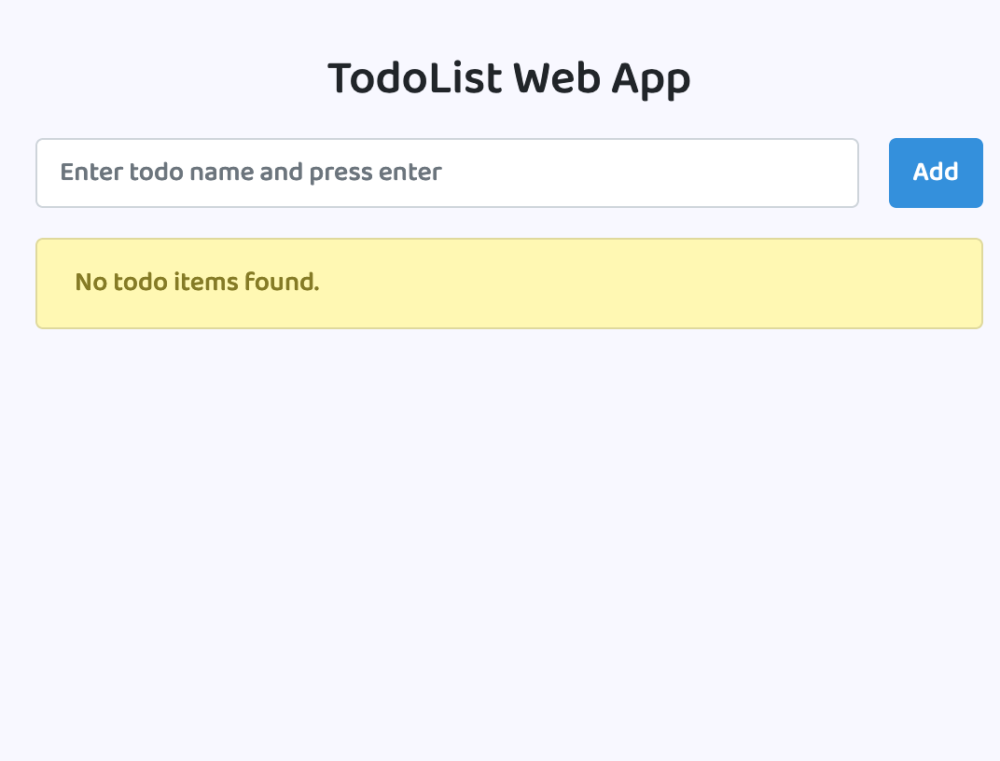

# Laravel Vue.js TodoList Web Application 🚀

[](https://laravel.com)
[](https://vuejs.org)

A modern Single Page Application (SPA) Todo List manager built with Laravel backend and Vue.js frontend. Features full CRUD operations with a clean, intuitive interface.


## Features ✨
- ✅ Create, Read, Update, Delete tasks
- 🎯 Real-time updates with Vue.js reactivity
- 💾 Persistent storage with MySQL database
- 🎨 Clean UI with modal-based editing
- 📱 Responsive design

## Screenshots 📸

| Empty List | With Items |
|------------|-------------|
|  |  |

| Edit Modal | Dark Mode |
|------------|-----------|
|  |  |

## Installation Guide ⚙️

1. **Clone the repository**
   ```bash
   git clone https://github.com/NevilPatel01/laravel-vuejs-todolist.git
   ```
   
   ``` bash
   cd laravel-vuejs-todolist
   ```

2. **Install PHP dependencies**
   ```bash
   composer install
   ```

3. **Configure environment**
   ```bash
   cp .env-example .env
   ```

4. **Set up database**
   - Create MySQL database
   - Update `.env` file:
     ```dotenv
     DB_CONNECTION=mysql
     DB_HOST=127.0.0.1
     DB_PORT=3306
     DB_DATABASE=db
     DB_USERNAME=root
     DB_PASSWORD=
     ```

5. **Run database migrations**
   ```bash
   php artisan migrate
   ```

6. **Generate application key**
   ```bash
   php artisan key:generate
   ```

7. **Install JavaScript dependencies**
   ```bash
   npm install && npm run dev
   ```

8. **Start development server**
   ```bash
   php artisan serve --port=8080
   ```

Visit `http://localhost:8080` in your browser to access the application!

## Technologies Used 🛠️

- **Backend**: Laravel 10
- **Frontend**: Vue.js 3
- **Database**: MySQL
- **Build Tool**: Laravel Mix (Webpack)

## Contributing 🤝

Contributions are welcome! Please follow these steps:
1. Fork the repository
2. Create your feature branch (`git checkout -b feature/AmazingFeature`)
3. Commit your changes (`git commit -m 'Add some AmazingFeature'`)
4. Push to the branch (`git push origin feature/AmazingFeature`)
5. Open a Pull Request

## License 📄

This project is open-source and available under the [MIT License](LICENSE).

---

**Happy Organizing!** ✨ *If you encounter any issues, please [open a ticket](https://github.com/NevilPatel01/laravel-vuejs-todolist/issues).*
